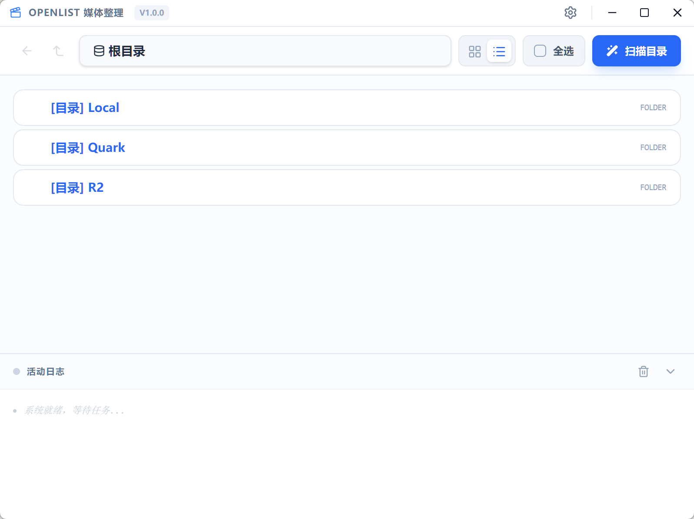

# OpenList 媒体整理工具 (OpenList Scraper)

**OpenList Scraper** 是一款现代化的本地媒体文件整理与元数据刮削工具。它专为影视爱好者设计，能够自动扫描本地或远程 (OpenList) 目录，智能识别剧集信息，刮削 TMDB 元数据，并批量执行重命名、生成 NFO 和下载海报等操作。



## ✨ 主要功能

*   **智能识别**：结合正则表达式与 **LLM (大语言模型)** 技术，精准识别文件名中的剧集、季数和集数信息，轻松应对各种复杂命名。
*   **元数据刮削**：对接 **TMDB (The Movie Database)** API，自动获取高质量的剧集简介、评分、发行日期和演职员表。
*   **批量整理**：
    *   **标准化重命名**：一键将乱序文件重命名为标准格式（如 `Series Name - S01E01 - Title.mkv`）。
    *   **NFO 生成**：生成兼容 Kodi/Emby/Plex 的 `.nfo` 元数据文件。
    *   **图片下载**：自动下载高清海报 (Poster) 和单集剧照 (Thumb)。
*   **双模式支持**：
    *   **本地模式**：直接管理本机硬盘或 NAS 挂载路径下的视频文件。
    *   **OpenList 模式**：支持连接 OpenList 服务器进行远程文件管理（需配置服务器 URL 和 Token）。
*   **现代化 UI**：基于 React + Tailwind CSS 构建的精美界面，支持 **深色模式 (Dark Mode)** 切换，提供网格与列表两种视图。
*   **灵活配置**：支持自定义正则匹配规则，可配置 OpenAI 兼容接口（如 LocalAI, Ollama）以降低识别成本。
*   **详细的日志系统**：内置活动日志面板，支持点击复制、折叠长日志（如 JSON 数据）、关键字高亮与多级日志过滤（Debug/Info/Error），方便排查元数据匹配问题。

## 🛠️ 技术栈

本项目基于以下前沿技术构建：

*   **框架核心**: [Electron](https://www.electronjs.org/) + [React](https://react.dev/) + [TypeScript](https://www.typescriptlang.org/)
*   **构建工具**: [Vite](https://vitejs.dev/)
*   **样式方案**: [Tailwind CSS v4](https://tailwindcss.com/)
*   **图标库**: [Lucide React](https://lucide.dev/)
*   **状态管理**: [Zustand](https://github.com/pmndrs/zustand)
*   **数据存储**: [Electron Store](https://github.com/sindresorhus/electron-store) (本地配置) + Better-SQLite3 (媒体库缓存)

## 🚀 快速开始

### 开发环境搭建

1.  **克隆仓库**
    ```bash
    git clone https://github.com/your-username/openlist-scraper.git
    cd openlist-scraper
    ```

2.  **安装依赖**
    推荐使用 `npm` 或 `pnpm`。
    ```bash
    npm install
    # 或者
    pnpm install
    ```

3.  **启动开发模式**
    同时启动 Vite 开发服务器和 Electron 主进程。
    ```bash
    npm run dev
    ```

### 打包发布

构建生产环境的安装包（支持 Windows/macOS/Linux）：

```bash
npm run build
```
打包后的文件将位于 `dist` 目录中。

## ⚙️ 配置指南

首次启动软件后，请点击右上角的 **设置 (Settings)** 图标进行初始化配置：

1.  **元数据源 (Metadata Provider)**：
    *   输入您的 **TMDB API Read Access Token**。您可以在 [TMDB 官网](https://www.themoviedb.org/settings/api) 免费申请。
2.  **LLM 模型 (可选)**：
    *   为了获得最佳的文件名识别体验，建议配置 OpenAI 兼容接口（如 `https://api.openai.com/v1` 或本地 Ollama 地址 `http://localhost:11434/v1`）。
    *   输入 API Key 和模型名称（如 `gpt-3.5-turbo` 或 `llama3`）。
3.  **媒体库 (Media Library)**：
    *   选择 **本地 (Local)** 并指定您的视频文件夹路径。
    *   或者配置 OpenList 服务器信息。
4.  **调试 (Debugging)**：
    *   在 **通用 (General)** 设置中，您可以调整日志级别。设置为 **Debug** 可以查看详细的 API 请求参数、LLM Prompt 和原始 JSON 响应，便于排查扫描失败的原因。

## 📝 使用说明

1.  **浏览文件**：在主界面浏览您的视频目录。
2.  **选择文件**：
    *   点击文件卡片左侧的复选框进行多选。
    *   或点击顶部的 **"全选"** 按钮。
3.  **开始匹配**：
    *   点击工具栏右侧的 **"匹配选中 (Match)"** 按钮。
    *   系统将自动分析文件名，并弹窗让您确认匹配到的剧集信息。
4.  **执行整理**：
    *   确认无误后，勾选需要的操作（重命名、NFO、海报、剧照）。
    *   点击 **"执行"**，稍等片刻即可完成整理！

## 📄 许可证

本项目采用 MIT 许可证。详见 LICENSE 文件。

---
© 2025 Landon Li